## Database Architecture

The Countries States Cities database follows a hierarchical structure with clear relationships between geographical entities. The schema is designed to be normalized, efficient, and consistent across all supported database formats.

```mermaid
erDiagram
    regions {
        int id PK
        string name
        string wikiDataId
        timestamp created_at
        timestamp updated_at
    }
    
    subregions {
        int id PK
        string name
        int region_id FK
        string wikiDataId
        timestamp created_at
        timestamp updated_at
    }
    
    countries {
        int id PK
        string name
        string iso3
        string iso2
        string numeric_code
        string phone_code
        string capital
        string currency
        string currency_name
        string currency_symbol
        string tld
        string native
        string region
        string subregion
        int region_id FK
        int subregion_id FK
        string nationality
        decimal latitude
        decimal longitude
        string emoji
        string emojiU
        timestamp created_at
        timestamp updated_at
    }
    
    states {
        int id PK
        string name
        int country_id FK
        string country_code
        string country_name
        string state_code
        string type
        decimal latitude
        decimal longitude
        timestamp created_at
        timestamp updated_at
    }
    
    cities {
        int id PK
        string name
        int state_id FK
        string state_code
        string state_name
        int country_id FK
        string country_code
        string country_name
        decimal latitude
        decimal longitude
        string wikiDataId
        timestamp created_at
        timestamp updated_at
    }
    
    regions ||--o{ subregions : contains
    subregions ||--o{ countries : contains
    regions ||--o{ countries : contains
    countries ||--o{ states : contains
    states ||--o{ cities : contains
```

<div className="my-6">

</div>

## Core Tables

### 1. Regions Table

The top-level geographical divisions based on UN regional classifications.

<ParamField path="id" type="integer" required>
Unique identifier for the region (Primary Key)
</ParamField>

<ParamField path="name" type="varchar(100)" required>
Official name of the region (e.g., "Europe", "Asia", "Africa")
</ParamField>

<ParamField path="wikiDataId" type="varchar(255)">
Wikidata identifier for additional reference data
</ParamField>

<ParamField path="created_at" type="timestamp">
Record creation timestamp
</ParamField>

<ParamField path="updated_at" type="timestamp">
Last modification timestamp
</ParamField>

**Sample Data:**
```json
{
  "id": 3,
  "name": "Europe",
  "wikiDataId": "Q46",
  "created_at": "2023-01-15T10:00:00Z",
  "updated_at": "2023-01-15T10:00:00Z"
}
```

### 2. Subregions Table

Subdivisions of regions providing more granular geographical classification.

<ParamField path="id" type="integer" required>
Unique identifier for the subregion (Primary Key)
</ParamField>

<ParamField path="name" type="varchar(100)" required>
Official name of the subregion (e.g., "Western Europe", "Southern Asia")
</ParamField>

<ParamField path="region_id" type="integer" required>
Foreign key reference to the parent region
</ParamField>

<ParamField path="wikiDataId" type="varchar(255)">
Wikidata identifier for additional reference data
</ParamField>

<ParamField path="created_at" type="timestamp">
Record creation timestamp
</ParamField>

<ParamField path="updated_at" type="timestamp">
Last modification timestamp
</ParamField>

**Sample Data:**
```json
{
  "id": 155,
  "name": "Western Europe",
  "region_id": 3,
  "wikiDataId": "Q27496",
  "created_at": "2023-01-15T10:00:00Z",
  "updated_at": "2023-01-15T10:00:00Z"
}
```

### 3. Countries Table

Complete country information with ISO codes, economic data, and geographical coordinates.

<ParamField path="id" type="integer" required>
Unique identifier for the country (Primary Key)
</ParamField>

<ParamField path="name" type="varchar(100)" required>
Official English name of the country
</ParamField>

<ParamField path="iso3" type="char(3)" required>
ISO 3166-1 alpha-3 code (e.g., "USA", "IND", "GBR")
</ParamField>

<ParamField path="iso2" type="char(2)" required>
ISO 3166-1 alpha-2 code (e.g., "US", "IN", "GB")
</ParamField>

<ParamField path="numeric_code" type="char(3)">
ISO 3166-1 numeric code
</ParamField>

<ParamField path="phone_code" type="varchar(255)">
International dialing code (e.g., "+1", "+91", "+44")
</ParamField>

<ParamField path="capital" type="varchar(255)">
Name of the country's capital city
</ParamField>

<ParamField path="currency" type="char(3)">
ISO 4217 currency code (e.g., "USD", "EUR", "INR")
</ParamField>

<ParamField path="currency_name" type="varchar(100)">
Full name of the currency
</ParamField>

<ParamField path="currency_symbol" type="varchar(10)">
Currency symbol (e.g., "$", "€", "₹")
</ParamField>

<ParamField path="tld" type="varchar(10)">
Top-level domain (e.g., ".us", ".in", ".uk")
</ParamField>

<ParamField path="native" type="varchar(255)">
Native name of the country in local language/script
</ParamField>

<ParamField path="region" type="varchar(100)">
Region name (denormalized for quick access)
</ParamField>

<ParamField path="subregion" type="varchar(100)">
Subregion name (denormalized for quick access)
</ParamField>

<ParamField path="region_id" type="integer">
Foreign key reference to the regions table
</ParamField>

<ParamField path="subregion_id" type="integer">
Foreign key reference to the subregions table
</ParamField>

<ParamField path="nationality" type="varchar(100)">
Demonym for country citizens (e.g., "American", "Indian", "British")
</ParamField>

<ParamField path="latitude" type="decimal(10,8)">
Geographical latitude coordinate of country center
</ParamField>

<ParamField path="longitude" type="decimal(11,8)">
Geographical longitude coordinate of country center
</ParamField>

<ParamField path="emoji" type="varchar(10)">
Unicode emoji flag representation
</ParamField>

<ParamField path="emojiU" type="varchar(20)">
Unicode code points for the flag emoji
</ParamField>

**Sample Data:**
```json
{
  "id": 231,
  "name": "United States",
  "iso3": "USA",
  "iso2": "US",
  "numeric_code": "840",
  "phone_code": "+1",
  "capital": "Washington",
  "currency": "USD",
  "currency_name": "US Dollar",
  "currency_symbol": "$",
  "tld": ".us",
  "native": "United States",
  "region": "Americas",
  "subregion": "Northern America",
  "region_id": 2,
  "subregion_id": 21,
  "nationality": "American",
  "latitude": 37.09024000,
  "longitude": -95.71289100,
  "emoji": "🇺🇸",
  "emojiU": "U+1F1FA U+1F1F8"
}
```

### 4. States Table

Administrative divisions within countries (states, provinces, regions, etc.).

<ParamField path="id" type="integer" required>
Unique identifier for the state (Primary Key)
</ParamField>

<ParamField path="name" type="varchar(255)" required>
Official name of the state/province/region
</ParamField>

<ParamField path="country_id" type="integer" required>
Foreign key reference to the parent country
</ParamField>

<ParamField path="country_code" type="char(2)" required>
ISO 2-letter country code for quick reference
</ParamField>

<ParamField path="country_name" type="varchar(100)">
Country name (denormalized for performance)
</ParamField>

<ParamField path="state_code" type="varchar(10)">
Official state/province code when available
</ParamField>

<ParamField path="type" type="varchar(191)">
Type of administrative division (state, province, region, etc.)
</ParamField>

<ParamField path="latitude" type="decimal(10,8)">
Geographical latitude coordinate of state center
</ParamField>

<ParamField path="longitude" type="decimal(11,8)">
Geographical longitude coordinate of state center
</ParamField>

**Sample Data:**
```json
{
  "id": 1416,
  "name": "California",
  "country_id": 231,
  "country_code": "US",
  "country_name": "United States",
  "state_code": "CA",
  "type": "state",
  "latitude": 36.77826100,
  "longitude": -119.41793240
}
```

### 5. Cities Table

Cities, towns, and other populated places within states/countries.

<ParamField path="id" type="integer" required>
Unique identifier for the city (Primary Key)
</ParamField>

<ParamField path="name" type="varchar(255)" required>
Official name of the city/town
</ParamField>

<ParamField path="state_id" type="integer" required>
Foreign key reference to the parent state
</ParamField>

<ParamField path="state_code" type="varchar(10)">
State code for quick reference
</ParamField>

<ParamField path="state_name" type="varchar(255)">
State name (denormalized for performance)
</ParamField>

<ParamField path="country_id" type="integer" required>
Foreign key reference to the country
</ParamField>

<ParamField path="country_code" type="char(2)" required>
ISO 2-letter country code for quick reference
</ParamField>

<ParamField path="country_name" type="varchar(100)">
Country name (denormalized for performance)
</ParamField>

<ParamField path="latitude" type="decimal(10,8)" required>
Geographical latitude coordinate
</ParamField>

<ParamField path="longitude" type="decimal(11,8)" required>
Geographical longitude coordinate
</ParamField>

<ParamField path="wikiDataId" type="varchar(255)">
Wikidata identifier for additional reference data
</ParamField>

**Sample Data:**
```json
{
  "id": 111968,
  "name": "Los Angeles",
  "state_id": 1416,
  "state_code": "CA",
  "state_name": "California", 
  "country_id": 231,
  "country_code": "US",
  "country_name": "United States",
  "latitude": 34.05223000,
  "longitude": -118.24368000,
  "wikiDataId": "Q65"
}
```

## Indexes and Performance

### Primary Indexes

All tables include clustered primary key indexes on the `id` field for optimal performance.

### Foreign Key Indexes

<CodeGroup>
```sql MySQL
-- States table indexes
CREATE INDEX idx_states_country_id ON states(country_id);
CREATE INDEX idx_states_country_code ON states(country_code);

-- Cities table indexes  
CREATE INDEX idx_cities_state_id ON cities(state_id);
CREATE INDEX idx_cities_country_id ON cities(country_id);
CREATE INDEX idx_cities_country_code ON cities(country_code);

-- Countries table indexes
CREATE INDEX idx_countries_region_id ON countries(region_id);
CREATE INDEX idx_countries_subregion_id ON countries(subregion_id);
CREATE INDEX idx_countries_iso2 ON countries(iso2);
CREATE INDEX idx_countries_iso3 ON countries(iso3);

-- Subregions table indexes
CREATE INDEX idx_subregions_region_id ON subregions(region_id);
```

```sql PostgreSQL
-- States table indexes
CREATE INDEX idx_states_country_id ON states(country_id);
CREATE INDEX idx_states_country_code ON states(country_code);

-- Cities table indexes
CREATE INDEX idx_cities_state_id ON cities(state_id);
CREATE INDEX idx_cities_country_id ON cities(country_id);
CREATE INDEX idx_cities_country_code ON cities(country_code);

-- Countries table indexes
CREATE INDEX idx_countries_region_id ON countries(region_id);
CREATE INDEX idx_countries_subregion_id ON countries(subregion_id);
CREATE INDEX idx_countries_iso2 ON countries(iso2);
CREATE INDEX idx_countries_iso3 ON countries(iso3);

-- Subregions table indexes
CREATE INDEX idx_subregions_region_id ON subregions(region_id);
```
</CodeGroup>

### Search Indexes

<Info>
For full-text search capabilities, consider adding text search indexes on name fields based on your database platform's capabilities.
</Info>

## Data Types by Platform

Different database platforms use slightly different data type specifications:

<Tabs>
  <Tab title="MySQL">
    ```sql
    -- Example table definition for MySQL
    CREATE TABLE countries (
        id INT AUTO_INCREMENT PRIMARY KEY,
        name VARCHAR(100) NOT NULL,
        iso2 CHAR(2) NOT NULL,
        iso3 CHAR(3) NOT NULL,
        latitude DECIMAL(10,8),
        longitude DECIMAL(11,8),
        created_at TIMESTAMP DEFAULT CURRENT_TIMESTAMP,
        updated_at TIMESTAMP DEFAULT CURRENT_TIMESTAMP ON UPDATE CURRENT_TIMESTAMP
    );
    ```
  </Tab>
  
  <Tab title="PostgreSQL">
    ```sql
    -- Example table definition for PostgreSQL
    CREATE TABLE countries (
        id SERIAL PRIMARY KEY,
        name VARCHAR(100) NOT NULL,
        iso2 CHAR(2) NOT NULL,
        iso3 CHAR(3) NOT NULL,
        latitude DECIMAL(10,8),
        longitude DECIMAL(11,8),
        created_at TIMESTAMP DEFAULT NOW(),
        updated_at TIMESTAMP DEFAULT NOW()
    );
    ```
  </Tab>
  
  <Tab title="SQLite">
    ```sql
    -- Example table definition for SQLite
    CREATE TABLE countries (
        id INTEGER PRIMARY KEY AUTOINCREMENT,
        name TEXT NOT NULL,
        iso2 TEXT NOT NULL,
        iso3 TEXT NOT NULL,
        latitude REAL,
        longitude REAL,
        created_at TEXT DEFAULT CURRENT_TIMESTAMP,
        updated_at TEXT DEFAULT CURRENT_TIMESTAMP
    );
    ```
  </Tab>
</Tabs>

## Relationships and Constraints

### Foreign Key Constraints

<Warning>
Foreign key constraints are enforced in most SQL databases but may need to be handled at the application level in some NoSQL implementations.
</Warning>

```sql
-- Foreign key relationships
ALTER TABLE subregions 
ADD CONSTRAINT fk_subregions_region 
FOREIGN KEY (region_id) REFERENCES regions(id);

ALTER TABLE countries 
ADD CONSTRAINT fk_countries_region 
FOREIGN KEY (region_id) REFERENCES regions(id);

ALTER TABLE countries 
ADD CONSTRAINT fk_countries_subregion 
FOREIGN KEY (subregion_id) REFERENCES subregions(id);

ALTER TABLE states 
ADD CONSTRAINT fk_states_country 
FOREIGN KEY (country_id) REFERENCES countries(id);

ALTER TABLE cities 
ADD CONSTRAINT fk_cities_state 
FOREIGN KEY (state_id) REFERENCES states(id);

ALTER TABLE cities 
ADD CONSTRAINT fk_cities_country 
FOREIGN KEY (country_id) REFERENCES countries(id);
```

### Data Integrity Rules

<AccordionGroup>
<Accordion title="Required Fields">
- All primary keys must be non-null and unique
- Country names, ISO codes are required
- State and city names are required
- Geographic coordinates are required for cities
</Accordion>

<Accordion title="Format Validation">
- ISO2 codes must be exactly 2 characters
- ISO3 codes must be exactly 3 characters  
- Phone codes must start with "+"
- Latitude must be between -90 and 90
- Longitude must be between -180 and 180
</Accordion>

<Accordion title="Referential Integrity">
- States must belong to valid countries
- Cities must belong to valid states and countries
- Countries must belong to valid regions and subregions
</Accordion>
</AccordionGroup>

## Common Queries

Here are some frequently used query patterns:

<CodeGroup>
```sql Get Country with States
SELECT 
    c.name AS country_name,
    c.iso2,
    s.name AS state_name,
    s.state_code
FROM countries c
LEFT JOIN states s ON c.id = s.country_id  
WHERE c.iso2 = 'US'
ORDER BY s.name;
```

```sql Get Cities by State
SELECT 
    ci.name AS city_name,
    ci.latitude,
    ci.longitude,
    s.name AS state_name,
    c.name AS country_name
FROM cities ci
JOIN states s ON ci.state_id = s.id
JOIN countries c ON s.country_id = c.id
WHERE s.country_code = 'US' AND s.state_code = 'CA'
ORDER BY ci.name;
```

```sql Regional Statistics
SELECT 
    r.name AS region_name,
    COUNT(DISTINCT c.id) AS country_count,
    COUNT(DISTINCT s.id) AS state_count,
    COUNT(ci.id) AS city_count
FROM regions r
LEFT JOIN countries c ON r.id = c.region_id
LEFT JOIN states s ON c.id = s.country_id  
LEFT JOIN cities ci ON s.id = ci.state_id
GROUP BY r.id, r.name
ORDER BY country_count DESC;
```
</CodeGroup>


## Next Steps

<CardGroup cols={2}>
  <Card title="Installation Guide" icon="download" href="/database/installation">
    Learn how to set up the database in your preferred environment.
  </Card>
</CardGroup>
