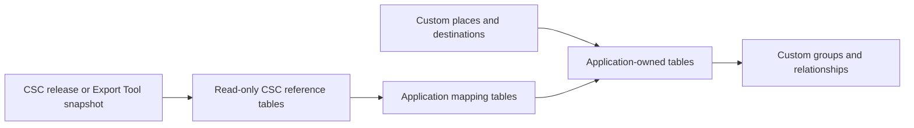

You can download Country State City data, import it into a privately hosted database, and maintain your own records and relationships alongside it. Commercial use is permitted under the [Open Database License (ODbL) v1.0](https://opendatacommons.org/licenses/odbl/1-0/).

The main design rule is simple: keep the CSC reference tables replaceable, and keep your application-owned data in separate tables.

<Note>
This page explains the CSC distribution model and our recommended technical architecture. It is not legal advice. If the licensing boundary is important to your business, ask qualified counsel to review your specific design.
</Note>

## Recommended architecture

Treat a CSC download or export as an upstream reference snapshot, not as the place where your application stores custom data.



A typical MySQL deployment uses either two databases on the same server or two clearly separated sets of tables:

| Layer | Example tables | Ownership | Update policy |
| --- | --- | --- | --- |
| CSC reference | `csc_countries`, `csc_states`, `csc_cities` | CSC snapshot | Replace only from a verified CSC release or export |
| Application data | `destinations`, `app_places`, `place_groups` | Your application | Changed by your application |
| Mapping | `destination_csc_links`, `place_group_members` | Your application | Links your records to CSC IDs |
| Overrides | `place_overrides` | Your application | Optional display or business-specific values without editing CSC rows |

This separation has three practical benefits:

- A CSC refresh cannot delete your custom records.
- You can compare or roll back CSC releases independently of application data.
- The boundary between the ODbL reference database and proprietary application data remains easier to understand and document.

### Adding a missing place

Do not insert a custom city into `csc_cities` or allocate an ID from the CSC ID space. Store it in an application-owned table with your own primary key. If useful, link it to a CSC country or state through a mapping column or table.

For example, an application record can have:

```sql
CREATE TABLE app_places (
  id BIGINT UNSIGNED NOT NULL AUTO_INCREMENT,
  name VARCHAR(255) NOT NULL,
  place_type VARCHAR(50) NOT NULL,
  csc_entity_type ENUM('country', 'state', 'city') DEFAULT NULL,
  csc_entity_id BIGINT UNSIGNED DEFAULT NULL,
  csc_parent_type ENUM('country', 'state', 'city') DEFAULT NULL,
  csc_parent_id BIGINT UNSIGNED DEFAULT NULL,
  latitude DECIMAL(10, 8) DEFAULT NULL,
  longitude DECIMAL(11, 8) DEFAULT NULL,
  PRIMARY KEY (id),
  UNIQUE KEY app_places_csc_reference (csc_entity_type, csc_entity_id)
) ENGINE=InnoDB DEFAULT CHARSET=utf8mb4 COLLATE=utf8mb4_unicode_ci;
```

- A CSC-backed place uses `csc_entity_type` and `csc_entity_id`.
- A missing or application-specific place leaves those fields empty and can use `csc_parent_type` and `csc_parent_id` to identify its CSC parent.
- Groups and parent/child relationships should reference `app_places.id`, so their IDs remain under your control.

<Tip>
If a missing or incorrect place should benefit all CSC users, submit it through the [Update Tool](/tools/update-tool). Keep your private record until the change appears in a published CSC release, then link or reconcile it explicitly.
</Tip>

## Preserve identifiers without depending on them blindly

Keep CSC's original `id` values unchanged inside the reference layer. They are required for relationships such as `states.country_id` and `cities.state_id`.

Do not assume that a numeric ID can never change in a future release. Before switching releases, validate important mappings using additional identifiers where available:

- Countries: `iso2` or `iso3`
- States: `iso3166_2`, country code, and state code
- Cities: `wikiDataId`, parent IDs, and country/state codes

Store the CSC release or export version used by your application so an issue can be reproduced against the same snapshot.

## Download and Export Tool options

### Complete database downloads

The [GitHub releases page](https://github.com/dr5hn/countries-states-cities-database/releases) publishes versioned, complete replacement assets in multiple formats. For MySQL, use the `sql-world.sql.gz` release asset.

Import a release into a new or staging database rather than over tables containing custom data:

```bash
gunzip -c sql-world.sql.gz | mysql --default-character-set=utf8mb4 -u YOUR_USER -p csc_next
```

<Warning>
Inspect the SQL before importing it. Complete database dumps may create, drop, or replace CSC tables. Never run a replacement dump against tables that also contain your custom records.
</Warning>

### Custom Export Tool downloads

The [Export Tool](https://export.countrystatecity.in) can produce a smaller snapshot for selected countries, datasets, fields, and formats. Choose the SQL format for a MySQL-ready export.

An Export Tool file can be imported into your own MySQL database and maintained independently. It is a point-in-time export: it does not remain connected to CSC and does not automatically update your server.

When exporting related datasets, include their relationship fields:

- Countries: `id`, `iso2`, and `iso3`
- States: `id`, `country_id`, `country_code`, `iso2`, and `iso3166_2`
- Cities: `id`, `country_id`, `state_id`, `country_code`, and `state_code`

## Applying future updates

Self-hosted downloads currently use a snapshot workflow:

| Capability | Complete GitHub download | Export Tool |
| --- | --- | --- |
| Versioned snapshot | Yes, by release tag | Yes, the export records its database version |
| Complete replacement | Yes | Yes, for the selected scope and fields |
| Incremental or delta file | No | No |
| Automatic merge into your database | No | No |
| Fresh data | Download a newer release | Renew or create a new export |

The Business API also provides `GET /v1/changes` for customers who need an incremental change feed. That API feature is separate from self-hosted download and Export Tool files.

### Safe refresh workflow

<Steps>
<Step title="Record the current version">
  Save the CSC release tag or Export Tool version, selected scope, fields, row counts, and file checksum.
</Step>

<Step title="Back up the current databases">
  Back up both the CSC reference layer and your application-owned tables before changing production data.
</Step>

<Step title="Import into staging">
  Load the new snapshot into a separate database such as `csc_next`. Do not overwrite the live CSC tables in place.
</Step>

<Step title="Validate and compare">
  Check row counts, required fields, parent references, and the CSC IDs used by your mapping tables. Review additions, removals, renamed records, and changed parents.
</Step>

<Step title="Reconcile affected mappings">
  Update only application mapping or override rows that no longer resolve cleanly. Your custom places, groups, and relationships remain untouched.
</Step>

<Step title="Switch and retain a rollback copy">
  Point the application to the validated snapshot or perform a controlled table swap. Keep the previous snapshot until production verification is complete.
</Step>
</Steps>

This process works for both complete releases and repeated Export Tool configurations. Export Tool renewal generates a fresh snapshot with the latest available version; it does not patch the previously downloaded file.

## Field availability

API pricing controls which fields an API plan returns. It does not make the underlying ODbL fields exclusive to the API.

The complete database downloads include the source schema. The Export Tool exposes selectable fields for countries, states, and cities, including the fields commonly requested for multi-level administrative data:

- `type`
- `level`
- `parent_id`
- `iso3166_2` on states
- `fips_code` on states
- `latitude` and `longitude`
- `timezone`
- `native`
- `population`
- `translations`
- `wikiDataId`

Field availability varies by entity, and some records legitimately contain null values. See the [database schema](/database/schema) and the live Export Tool field selector for the exact current list.

Some API response fields are computed services rather than stored database columns. Examples include search relevance, distance from a query point, and current timezone offset or daylight-saving status.

## ODbL considerations

### Which terms apply

The standard delivery routes do not change the licence on the underlying CSC data:

| Delivery route | Data licence | Additional terms |
| --- | --- | --- |
| GitHub release | ODbL v1.0 and the Database Contents License (DbCL) | GitHub's platform terms may apply to use of GitHub |
| Export Tool | ODbL v1.0 and DbCL | Export Tool terms govern the account, credits, export service, and hosted download |
| REST API | ODbL v1.0 and DbCL | API terms govern the account, API key, quotas, rate limits, and hosted service |

Paying for Export Tool credits or an API plan does not currently grant a separate OEM licence or waive ODbL. It pays for the hosted service, selected scope and fields, generated formats, capacity, and support.

The Export Tool uses the public CSC repository and release assets as its upstream geographic corpus. An export may not be byte-for-byte identical to a named GitHub release because it reflects the tool's recorded synchronization time, your field and country selections, output format, sorting, and optional name translation.

### Private and internal use

ODbL permits commercial use. Section 4.5(c) also states that internal use of a derivative database is not public use, so you can privately modify and extend a self-hosted copy without publishing those internal changes.

### Public applications

If an application publicly displays or otherwise uses a Produced Work based on a substantial part of CSC data, ODbL section 4.3 requires a notice that makes users aware of the source and licence. Use the CSC attribution:

```text
Data by Countries States Cities Database
https://github.com/dr5hn/countries-states-cities-database | ODbL v1.0
```

Also link to the [ODbL v1.0 licence](https://opendatacommons.org/licenses/odbl/1-0/).

Network access without transferring a copy of the database is not **Conveying** under ODbL. That does not mean every SaaS use is exempt from share-alike: section 4.4(c) treats a derivative database as publicly used when a Produced Work from that derivative database is publicly used.

### Proprietary data and derivative databases

ODbL distinguishes a **Derivative Database** from a **Collective Database**:

- Public use of a derivative CSC database triggers the share-alike and machine-readable access requirements in sections 4.4 and 4.6. This can also apply when a public Produced Work is generated from that derivative database.
- A collection of independent databases does not require the entire collection to use ODbL under section 4.5(a), although the CSC component remains under ODbL.
- Creating a Produced Work from an unmodified CSC database does not by itself create a derivative database under section 4.5(b), but public attribution can still be required.

Keeping CSC reference tables unmodified and keeping proprietary destination, tourism, grouping, and relationship data in separately owned tables makes this distinction clearer. A technical separation does not by itself determine the legal result; the substance of how the data is combined and publicly used still matters.

### What share-alike requires

If you publicly use a derivative CSC database or a Produced Work from it, section 4.6 requires you to offer recipients one of the following in machine-readable form:

- the entire derivative database; or
- all alterations, or the method used to make them, including additional contents needed to recreate every difference from the CSC database.

This does not require you to publish your application code, customer records, or unrelated proprietary tables. Whether a mapping or joined dataset is an independent component of a Collective Database or part of the derivative database depends on how it is combined and used, not only on whether it has a separate table name.

### Content sources and provenance

CSC is a community-maintained database. Contributions may use official government data, ISO material, Wikidata, Wikipedia, GeoNames, OpenStreetMap, and other documented sources. The repository's [Database Contents License](https://github.com/dr5hn/countries-states-cities-database/blob/master/.github/CONTENT_LICENSE) grants the rights CSC can grant in the individual contents and requires compliance with ODbL.

ODbL governs database rights, but section 2.4 notes that independent rights in individual contents can exist. CSC does not currently publish a complete row-by-row or field-by-field provenance and third-party licence register for every country, state, and city field. Source information for newer contributions is generally available in the pull request history, but is not embedded in every exported row.

For legal, tax, regulatory, emergency, navigation, or official-boundary uses, obtain the controlling identifiers from the responsible authority, retain their source and version, and validate your mappings independently. The standard downloads, Export Tool, and API do not include a contractual field-by-field provenance warranty.

## Quick answers

<AccordionGroup>
<Accordion title="Can I host CSC data on my own MySQL server?">
Yes. Import a complete MySQL release or a custom SQL export into a database you control.
</Accordion>

<Accordion title="Can I add missing cities and private relationships?">
Yes. Use application-owned tables and IDs rather than inserting custom rows into the replaceable CSC tables.
</Accordion>

<Accordion title="Will CSC update my private database automatically?">
No. Download a new release or renew your Export Tool configuration, import it into staging, validate it, and switch it into service yourself.
</Accordion>

<Accordion title="Are incremental files available for self-hosted downloads?">
No. GitHub downloads and Export Tool files are snapshots. The Business API change feed is the incremental option.
</Accordion>

<Accordion title="Are extended fields exclusive to paid API plans?">
No. API plans govern API responses. The source fields remain available through complete database downloads, and the Export Tool exposes selectable fields according to its current field list.
</Accordion>

<Accordion title="Can my proprietary tourism data remain private?">
Internal use does not trigger ODbL public share-alike. For a public application, keep proprietary data separate from the CSC reference database and obtain legal advice if you need a definitive classification of your architecture.
</Accordion>

<Accordion title="Does a paid Export Tool or API plan remove ODbL?">
No. Standard paid products provide delivery, selection, format, capacity, updates, and support. They do not currently provide an OEM licence or waive ODbL.
</Accordion>

<Accordion title="Does SaaS use trigger share-alike?">
Displaying output from an unmodified CSC reference database does not itself create a derivative database, although public attribution can be required. If you transform a substantial part of CSC into a new database and publicly serve output from it, ODbL section 4.4(c) can trigger share-alike and section 4.6 access requirements.
</Accordion>
</AccordionGroup>
