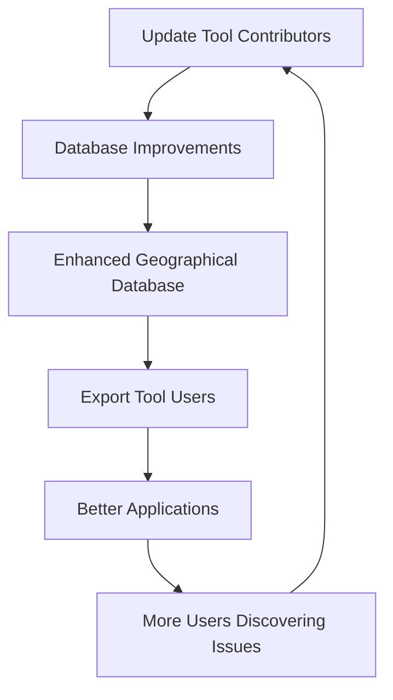

## Choose Your Tool

<CardGroup cols={2}>
<Card title="Export Tool" icon="download" href="/tools/export-tool">
  **Get Data** - Create custom geographical data exports without downloading massive databases
</Card>
<Card title="Update Tool" icon="pen-to-square" href="/tools/update-tool">
  **Contribute Data** - Help improve the world's most comprehensive geographical database
</Card>
</CardGroup>

---

## Which Tool is Right for You?

<Tabs>
<Tab title="I Need Data">
**Choose Export Tool if you want to:**

- Get custom geographical data for your application  
- Export only specific fields you need  
- Choose from multiple formats (JSON, CSV, XML, YAML, SQL)  
- Save development time on data preparation  
- Pay only for what you use with credits  

**Perfect for:** E-commerce sites, mobile apps, analytics platforms, business intelligence, any application needing location data.

<Card title="Start Exporting" icon="rocket" href="/tools/export-tool/getting-started">
Get 5 free credits and create your first custom export
</Card>
</Tab>

<Tab title="I Want to Contribute">
**Choose Update Tool if you want to:**

- Fix incorrect geographical information  
- Add missing countries, states, or cities  
- Update outdated location data  
- Help thousands of developers worldwide  
- Contribute to open-source geographical data  

**Perfect for:** Data enthusiasts, local experts, developers who've found data issues, anyone passionate about data accuracy.

<Card title="Start Contributing" icon="heart" href="/tools/update-tool">
Join thousands improving geographical data worldwide
</Card>
</Tab>
</Tabs>

---

## Export Tool - Get the Data You Need

Transform how you work with geographical data. Instead of downloading massive databases and writing complex filtering code, get exactly the data you need in minutes.

### Key Features

<CardGroup cols={3}>
<Card title="Selective Data" icon="filter">
  Pick specific datasets and fields - no data bloat
</Card>
<Card title="5 Formats" icon="file-code">
  JSON, CSV, XML, YAML, and SQL ready for any system
</Card>
<Card title="Credits System" icon="credit-card">
  Pay only for what you use - no subscriptions
</Card>
</CardGroup>

### Popular Use Cases

| Use Case | Data Needed | Cost | Format |
|:---------|:------------|:-----|:--------|
| **E-commerce Checkout** | Countries with currencies | 1 credit | JSON |
| **Location Services** | Cities with coordinates | 3 credits | JSON |
| **Data Analytics** | Countries with coordinates/timezones | 2 credits | CSV |

### Quick Start Process

<Steps>
<Step title="Sign Up Free">
  Get 5 free credits instantly
</Step>
<Step title="Select Data">
  Choose countries, states, or cities with specific fields
</Step>
<Step title="Pick Format">
  Choose JSON, CSV, XML, YAML, or SQL
</Step>
<Step title="Export & Download">
  Get your custom dataset as a convenient ZIP file
</Step>
</Steps>

<Tip>
**Free Trial**: Start with 3 free credits to test the system. Countries data in JSON format costs only 1 credit!
</Tip>

---

## Update Tool - Improve Global Data Quality

Contribute to the world's most comprehensive geographical database used by thousands of developers. Your contributions help millions of users get accurate location information.

### Your Global Impact

Every correction you make helps:

<CardGroup cols={2}>
<Card title="Thousands of Developers" icon="code">
  Use this data in their applications worldwide
</Card>
<Card title="Millions of Users" icon="users">
  Get accurate location information in apps and services
</Card>
<Card title="Better Applications" icon="mobile">
  E-commerce, weather, travel, and mapping apps
</Card>
<Card title="Open Source Community" icon="heart">
  Strengthen the open-source geographical data ecosystem
</Card>
</CardGroup>

### What You Can Contribute

- **Countries**: Add new countries or fix country information
- **Regions**: Continental and sub-continental groupings  
- **States/Provinces**: Administrative divisions within countries
- **Cities**: Urban areas and municipalities

### Simple Contribution Process

<Steps>
<Step title="Sign In">
  Use Magic Link (email) or GitHub authentication
</Step>
<Step title="Submit Change">
  Add, update, or delete geographical data with sources
</Step>
<Step title="Community Review">
  Admins and community members review your changes
</Step>
<Step title="Database Integration">
  Approved changes are incorporated into the main database
</Step>
<Step title="Global Distribution">
  Your improvements help developers worldwide
</Step>
</Steps>

### Track Your Contributions

- **Statistics**: Total submissions and approval rate
- **Notifications**: Real-time updates on your requests
- **Impact Metrics**: See how many developers benefit from your changes
- **Incorporation Tracking**: Follow changes through the entire system

<Check>
**100% Free**: Contributing is completely free and helps the entire developer community!
</Check>

---

## How Tools Work Together

The Export Tool and Update Tool create a powerful ecosystem:

---

## Need Help?

<CardGroup cols={3}>
<Card title="Export Tool Docs" icon="book" href="/tools/export-tool">
  Complete guide to creating custom data exports
</Card>
<Card title="Update Tool Guide" icon="graduation-cap" href="/tools/update-tool">
  Learn how to contribute geographical improvements
</Card>
<Card title="API Documentation" icon="code" href="/api/introduction">
  Integrate geographical data directly into your applications
</Card>
</CardGroup>

---

## Join the Community

Whether you're consuming geographical data or contributing improvements, you're part of a global community making location data more accurate and accessible for everyone.

**Ready to get started?**

<CardGroup cols={2}>
<Card title="Export Data Now" icon="download" href="/tools/export-tool/getting-started">
Get 5 free credits and create your first custom export
</Card>
<Card title="Contribute Today" icon="heart" href="/tools/update-tool">
Make your first contribution to improve global data quality
</Card>
</CardGroup>

---

<Note>
**Questions?** Our community is here to help. Check our documentation, join GitHub discussions, or reach out directly for support.
</Note>
